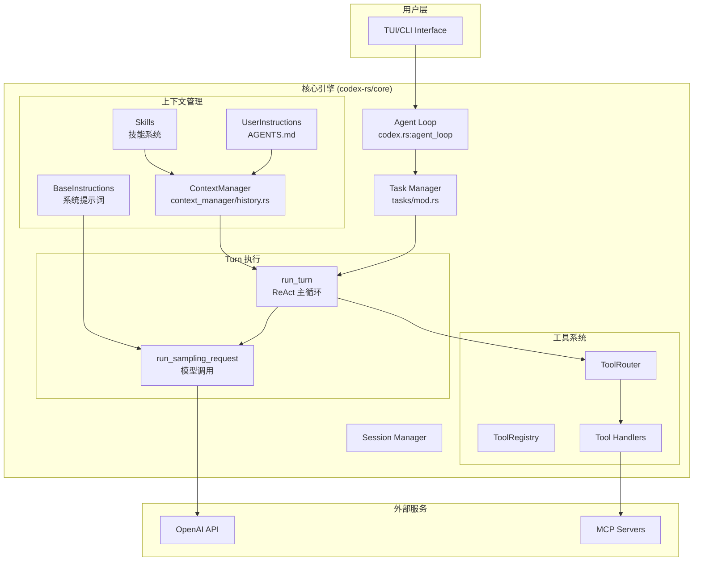
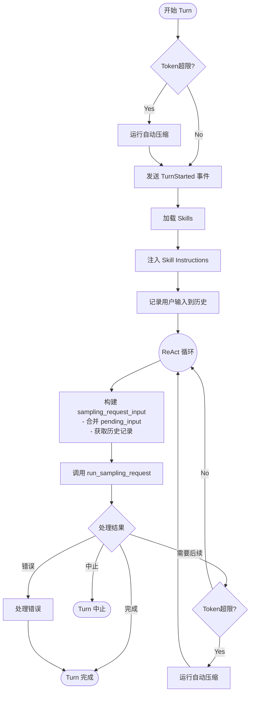
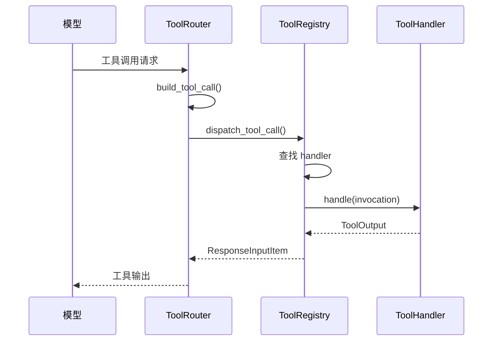
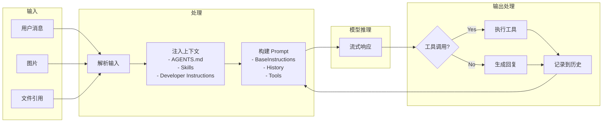

# 🧠 Codex Agent 核心 ReAct 工作流分析

## 1. 整体架构概览



---

## 2. 核心 ReAct 循环 (`run_turn`)

ReAct (Reasoning + Acting) 循环位于 `codex-rs/core/src/codex.rs` 中的 `run_turn` 函数：

### 2.1 主循环流程

```rust
pub(crate) async fn run_turn(
    sess: Arc<Session>,
    turn_context: Arc<TurnContext>,
    input: Vec<UserInput>,
    cancellation_token: CancellationToken,
) -> Option<String>
```

**执行流程：**



### 2.2 采样请求 (`run_sampling_request`)

```rust
async fn run_sampling_request(
    sess: Arc<Session>,
    turn_context: Arc<TurnContext>,
    turn_diff_tracker: SharedTurnDiffTracker,
    client_session: &mut ModelClientSession,
    input: Vec<ResponseItem>,
    cancellation_token: CancellationToken,
) -> CodexResult<SamplingRequestResult>
```

**关键步骤：**
1. **获取 MCP 工具** - 从 `mcp_connection_manager` 获取所有可用工具
2. **构建工具路由** - `ToolRouter::from_config()` 创建工具分发器
3. **构建 Prompt** - 组装 `base_instructions`、`tools`、`personality` 等
4. **流式调用模型** - `client_session.stream(prompt)`
5. **处理输出** - 工具调用 or 消息输出

---

## 3. Rules/Prompt 系统

### 3.1 系统提示词层级

```
┌─────────────────────────────────────────────────────────────┐
│                    BaseInstructions                          │
│  (models_manager/model_info.rs - 按模型选择不同提示词)       │
├─────────────────────────────────────────────────────────────┤
│                                                              │
│  ┌────────────────┐    ┌────────────────┐                   │
│  │  prompt.md     │    │ gpt_5_2_prompt │                   │
│  │  (默认基础)    │    │   .md (GPT-5.2)│                   │
│  └────────────────┘    └────────────────┘                   │
│                                                              │
├─────────────────────────────────────────────────────────────┤
│              UserInstructions (运行时注入)                   │
│  ┌────────────────┐    ┌────────────────┐                   │
│  │  AGENTS.md     │    │  Skills 列表   │                   │
│  │  (项目文档)    │    │  (技能描述)    │                   │
│  └────────────────┘    └────────────────┘                   │
├─────────────────────────────────────────────────────────────┤
│              DeveloperInstructions                           │
│        (开发者通过配置注入的额外指令)                        │
└─────────────────────────────────────────────────────────────┘
```

### 3.2 BaseInstructions 构建

**文件位置：** `codex-rs/core/src/models_manager/model_info.rs`

```rust
pub const BASE_INSTRUCTIONS: &str = include_str!("../../prompt.md");
const GPT_5_2_INSTRUCTIONS: &str = include_str!("../../gpt_5_2_prompt.md");
// ... 针对不同模型的提示词
```

**主要提示词文件：** `codex-rs/core/gpt-5.2-codex_prompt.md`

核心规则包括：
- 代码编辑约束（ASCII优先、简洁注释、使用 `apply_patch`）
- Git 工作区保护（不要恢复未授权的更改）
- Plan 工具使用指南
- 前端设计规范
- 最终响应格式要求

### 3.3 UserInstructions (AGENTS.md)

**文件位置：** `codex-rs/core/src/project_doc.rs`

```rust
pub(crate) async fn get_user_instructions(
    config: &Config,
    skills: Option<&[SkillMetadata]>,
) -> Option<String> {
    let project_docs = read_project_docs(config).await;  // 读取 AGENTS.md
    // ... 合并 config.user_instructions + project_docs + skills_section
}
```

**AGENTS.md 发现规则：**
1. 从当前工作目录向上遍历到 Git 根目录
2. 收集所有 `AGENTS.md` 文件并按顺序拼接
3. 优先使用 `AGENTS.override.md`（本地覆盖）

**层级说明消息：** `codex-rs/core/hierarchical_agents_message.md`
> "Files called AGENTS.md commonly appear in many places... Each AGENTS.md governs the entire directory that contains it and every child directory beneath that point."

---

## 4. Memory (对话历史管理)

### 4.1 ContextManager

**文件位置：** `codex-rs/core/src/context_manager/history.rs`

```rust
pub(crate) struct ContextManager {
    items: Vec<ResponseItem>,      // 对话历史（最旧在前）
    token_info: Option<TokenUsageInfo>,  // Token 使用统计
}
```

**核心方法：**

| 方法 | 功能 |
|------|------|
| `record_items()` | 记录新的对话项 |
| `for_prompt()` | 准备发送给模型的历史（归一化） |
| `estimate_token_count()` | 估算 token 数量 |
| `drop_last_n_user_turns()` | 回滚最近 N 轮对话 |
| `replace_last_turn_images()` | 替换工具输出中的图片 |

### 4.2 历史归一化

```rust
fn normalize_history(&mut self) {
    // 1. 确保每个函数调用都有对应的输出
    normalize::ensure_call_outputs_present(&mut self.items);
    // 2. 移除没有对应调用的孤立输出
    normalize::remove_orphan_outputs(&mut self.items);
}
```

### 4.3 自动压缩 (Compaction)

当 token 使用量接近上下文窗口限制时触发：

```rust
if total_usage_tokens >= auto_compact_limit {
    run_auto_compact(&sess, &turn_context).await;
}
```

**压缩策略：** `codex-rs/core/src/compact.rs` / `codex-rs/core/src/compact_remote.rs`

---

## 5. Knowledge (Skills 技能系统)

### 5.1 Skills 架构

**文件位置：** `codex-rs/core/src/skills/`

```
skills/
├── mod.rs           # 模块导出
├── model.rs         # SkillMetadata 数据模型
├── loader.rs        # 技能加载器
├── manager.rs       # SkillsManager
├── injection.rs     # 技能注入到提示词
├── render.rs        # 渲染技能列表为 Markdown
└── system.rs        # 系统内置技能
```

### 5.2 SkillMetadata

```rust
pub struct SkillMetadata {
    pub name: String,
    pub description: String,
    pub short_description: Option<String>,
    pub interface: Option<SkillInterface>,
    pub path: PathBuf,      // SKILL.md 文件路径
    pub scope: SkillScope,  // Global/Project/Workspace
}
```

### 5.3 技能注入流程

```rust
pub(crate) async fn build_skill_injections(
    inputs: &[UserInput],
    skills: Option<&SkillLoadOutcome>,
    otel: Option<&OtelManager>,
) -> SkillInjections
```

**触发规则（在 render.rs 中定义）：**
> "If the user names a skill (with `$SkillName` or plain text) OR the task clearly matches a skill's description shown above, you must use that skill for that turn."

### 5.4 技能文件结构

```
my-skill/
├── SKILL.md          # 主文件（YAML frontmatter + Markdown body）
├── scripts/          # 可执行脚本
├── references/       # 参考文档
└── assets/           # 资源文件
```

---

## 6. Tools (工具系统)

### 6.1 工具注册表

**文件位置：** `codex-rs/core/src/tools/registry.rs`

```rust
pub struct ToolRegistry {
    handlers: HashMap<String, Arc<dyn ToolHandler>>,
}

#[async_trait]
pub trait ToolHandler: Send + Sync {
    fn kind(&self) -> ToolKind;
    async fn is_mutating(&self, invocation: &ToolInvocation) -> bool;
    async fn handle(&self, invocation: ToolInvocation) -> Result<ToolOutput, FunctionCallError>;
}
```

### 6.2 内置工具处理器

| Handler | 工具名 | 功能 |
|---------|--------|------|
| `ApplyPatchHandler` | `apply_patch` | 应用代码补丁 |
| `ShellHandler` | `shell` | 执行 Shell 命令 |
| `ReadFileHandler` | `read_file` | 读取文件 |
| `ListDirHandler` | `list_dir` | 列出目录 |
| `GrepFilesHandler` | `grep_files` | 搜索文件 |
| `PlanHandler` | `update_plan` | 更新任务计划 |
| `CollabHandler` | `spawn_agent` 等 | 多 Agent 协作 |
| `McpHandler` | MCP 工具 | 调用 MCP 服务器工具 |
| `ViewImageHandler` | `view_image` | 查看图片 |
| `RequestUserInputHandler` | `request_user_input` | 请求用户输入 |

### 6.3 工具路由

**文件位置：** `codex-rs/core/src/tools/router.rs`

```rust
pub struct ToolRouter {
    registry: ToolRegistry,
    specs: Vec<ConfiguredToolSpec>,
}
```

**工具调用流程：**



### 6.4 并行工具执行

**文件位置：** `codex-rs/core/src/tools/parallel.rs`

```rust
pub(crate) struct ToolCallRuntime {
    router: Arc<ToolRouter>,
    session: Arc<Session>,
    turn_context: Arc<TurnContext>,
    tracker: SharedTurnDiffTracker,
    parallel_execution: Arc<RwLock<()>>,  // 控制并行/串行执行
}
```

---

## 7. Plan 工具

**文件位置：** `codex-rs/core/src/tools/handlers/plan.rs`

```rust
pub static PLAN_TOOL: LazyLock<ToolSpec> = LazyLock::new(|| {
    ToolSpec::Function(ResponsesApiTool {
        name: "update_plan".to_string(),
        description: r#"Updates the task plan.
Provide an optional explanation and a list of plan items, each with a step and status.
At most one step can be in_progress at a time."#,
        // ...
    })
});
```

**Plan 工具的作用：**
> "This function doesn't do anything useful. However, it gives the model a structured way to record its plan that clients can read and render."

---

## 8. 多 Agent 协作 (Orchestrator)

### 8.1 Agent 角色定义

**文件位置：** `codex-rs/core/src/agent/role.rs`

```rust
pub enum AgentRole {
    Default,        // 继承父配置
    Orchestrator,   // 协调者 Agent
    Worker,         // 工作者 Agent
}
```

### 8.2 Orchestrator 提示词

**文件位置：** `codex-rs/core/templates/agents/orchestrator.md`

核心职责：
- 理解任务并分解
- 委派工作给 Workers
- 监控进度、解决冲突、整合结果

**协作工具：**
- `spawn_agent` - 创建 Worker
- `send_input` - 发送消息
- `wait` - 等待完成
- `close_agent` - 关闭 Worker

### 8.3 Collab Handler

**文件位置：** `codex-rs/core/src/tools/handlers/collab.rs`

---

## 9. 数据流总结



---

## 10. 关键设计特点

1. **模块化提示词系统** - 支持多层次的指令注入（系统级 → 项目级 → 技能级）
2. **流式处理** - 使用 `tokio` 异步流处理模型响应
3. **工具门控** - 突变性工具需要等待 `tool_call_gate` 批准
4. **自动压缩** - 智能管理上下文窗口，防止 token 溢出
5. **可取消任务** - 所有任务支持 `CancellationToken` 中断
6. **多 Agent 协作** - 支持 Orchestrator/Worker 模式的分布式任务执行
7. **MCP 扩展** - 通过 MCP 协议支持外部工具集成
